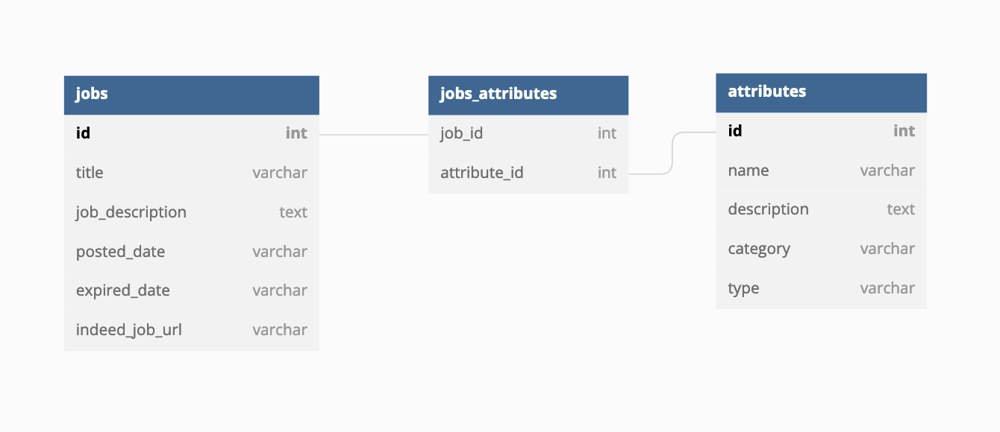

# Web Scraping Take Home Assignment

This project is the solution i came up with for part 1 and 2 of the take home assignment for UpWage.

## Part One: Scraper

### Features

- Connecting to local Postgres jobs table
- Accessing web page specified in the indeed_job_url column
- Scraping job page data based on job expired state
- Updating records in postgresql
- Junction table design
- Sample SQL query for many to many relationship, given job_id

### Environment Variables

To run this project, you will need to add the following environment variables to an .env file

`HOST` ,
`DATABASE` ,
`USERNAME` ,
`PW` ,
`PORT`

These are used to establish a connection between the project and a local Postgres database.

### Packages needed

Install the following python packages with pip3

```bash
  requests
  psycopg2
  beautifulsoup4
  python-dotenv
  lxml
```

## Part Two: Extra Credit, Encouraged to Complete

### Junction Table (Many to Many) Design

### SQL Query



https://dbdiagram.io/d/62dc67c70d66c74655383eef

```sql
select *
from jobs_attributes
join jobs on jobs.id = jobs_attributes.job_id
join attributes on attributes.id = jobs_attributes.attribute_id
where jobs.id = 552577
```

## Part 3: Extra Credit, Optional

One approach I would try is using a AWS lambda that rotates IPs regularly. This would be cost effective since with Lambda functions, you only pay for the amount used rather than paying for having a server up and running 24/7.

Another approach i would try, to avoid reinventing the wheel, is a rotating proxy service like Zyte Smart Proxy Manager. This is an API where the requests you make would be routed through a pool of high quality proxies.
https://docs.zyte.com/smart-proxy-manager/integrations/python.html
